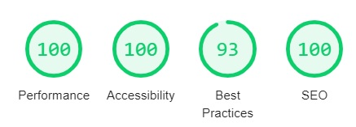

# Portfolio

A simple web portfolio made with <a href="http://www.tailwindcss.com">TailwindCSS</a>, a utility-based CSS framework allowing devs to quickly prototype layouts. This app can be bundled with either <a href="http://www.parcel.org">Parcel</a> or <a href="http://www.webpack.org">Webpack</a>.

### Deployment

To deploy this website, first generate the files with a module bundler :

- For parcel :
    `npm run parcel`

- For webpack :
    `npm run webpack`
                 
Then, all you have to do is upload the contents of the `dist` directory into your previously configured Apache server.

### Performances

